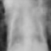

# Medical Image Generation with VAE

In this homework, we learn how to use variational autoencoder (VAE) to generate medical images. First, understand the code of VAE in https://github.com/AntixK/PyTorch-VAE . Then, take the chest X-ray dataset from https://www.kaggle.com/paultimothymooney/chest-xray-pneumonia and train a VAE model using code in the github link above on the chest X-ray dataset. Use the trained VAE to generate chest X-ray images, and write a report (2 pages, NeurIPS format). In the report, you can include the following: 1) hyperparameter settings; 2) training loss curves; 3) Inception score and FID score of generated images, using code from https://pytorch-ignite.ai/blog/gan-evaluation-with-fid-and-is/ 4) examples of generated images. Submit the report to Gradescope.

## Dataset

This project uses the chest X-ray dataset from Kaggle:
https://www.kaggle.com/paultimothymooney/chest-xray-pneumonia

**How to get the data:**
1. Download the dataset from the Kaggle link above (you need a Kaggle account).
2. Unzip the dataset and place the `chest_xray` folder under the `Data/` directory of this project, so the path is:
   `Data/chest_xray/train`, `Data/chest_xray/val`, `Data/chest_xray/test`

## Model Evaluation

To evaluate the generated images, we use metrics such as FID (Fréchet Inception Distance) and Inception Score (IS).
You can use the code from [PyTorch-Ignite GAN evaluation blog](https://pytorch-ignite.ai/blog/gan-evaluation-with-fid-and-is/) to compute these metrics.

**Example usage:**
- Install the required packages:
  ```bash
  pip install pytorch-ignite torchmetrics
  ```
- See the official blog for code snippets and details:
  https://pytorch-ignite.ai/blog/gan-evaluation-with-fid-and-is/

## Features

- Data preprocessing: Load and preprocess chest X-ray images
- Model training: Train a VAE for medical image generation
- Image generation: Generate new chest X-ray images
- Quality evaluation: Evaluate generated images with multiple metrics

## Project Structure

```
.
├── configs/
│   └── chest_xray_vae.yaml    # Model config file
├── models/
│   ├── base.py               # Base model class
│   ├── vanilla_vae.py        # VAE implementation
│   └── __init__.py
├── dataset.py                # Data loading and preprocessing
├── train_chest_xray.py       # Model training script
├── generate_samples.py       # Image generation script
├── prepare_real_images.py    # Real image preparation script
├── compute_metrics.py        # Evaluation metrics script
├── requirements.txt          # Python dependencies
└── environment.yml           # Conda environment config
```

## Quick Start

1. **Environment Setup**
```bash
conda env create -f environment.yml
# or
pip install -r requirements.txt
```

2. **Prepare Real Images**
```bash
python prepare_real_images.py --data_path Data/chest_xray/train --num_samples 5000
```

3. **Train the Model**
```bash
python train_chest_xray.py --config configs/chest_xray_vae.yaml
```

4. **Generate Samples**
```bash
python generate_samples.py --checkpoint logs/ChestXrayVAE/final_model.ckpt --num_samples 5000
```

5. **Evaluate Generated Images**
```bash
python compute_metrics.py --real_path real --generated_path generated
```

## Generated Examples

Below are some examples of chest X-ray images generated by the VAE model:

<p align="center">
  
  
  
  
  
</p>

## Evaluation Metrics

This project uses the following metrics to evaluate the quality of generated images:
- FID (Fréchet Inception Distance)
- IS (Inception Score)
- SSIM (Structural Similarity Index)
- PSNR (Peak Signal-to-Noise Ratio)

## Dependencies

- Python 3.8+
- PyTorch 1.8+
- torchvision
- numpy
- scikit-learn
- scikit-image
- tensorboard
- pytorch-lightning

## License

This project is licensed under the MIT License. See [LICENSE.md](LICENSE.md) for details.
